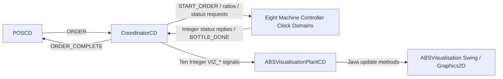

# Milestone 1 Proposal: Symbolic Visualisation of an Automated Bottling System

## 1. Introduction and Motivation

The COMPSYS704 Automated Bottling System (ABS) is a distributed SystemJ
application in which the Point of Sale (POS), Coordinator, Machine
Controllers, and Plants cooperate across separate Clock Domains. Although
console messages can confirm individual events, they do not provide a concise
view of the overall production state. This Individual Project proposes a
read-only symbolic visualisation that presents the current state of the
production line without becoming part of the machine-control path.

The motivation is to improve observability while preserving the distributed
architecture. Operators and developers should be able to see which machines
are waiting, idle, ready, busy, complete, or faulty, together with current
batch progress. The display must remain truthful: Phase 1 reports only state
that is genuinely supplied through the implemented Coordinator interface.

## 2. Proposed Individual Project

The project will develop and evaluate an Overall ABS Visualisation Plant
formed by the SystemJ Clock Domain `ABSVisualisationPlantCD` and the handwritten
Swing class `ABSVisualisation`. The Clock Domain receives Coordinator-generated
`VIZ_*` signals and invokes Java update methods. The Swing layer then renders a
symbolic production-line schematic containing the Bottle Loader, Conveyor,
Rotary Table, Filler A, Filler B, Lid Loader, Capper, and Bottle Unloader.

Phase 1 focuses on machine status and product-batch progress. Phase 2 is a
proposed extension for symbolic workpiece positions and concurrent bottle
tracking. Phase 2 will require an agreed source of position events; it will not
infer bottle locations from machine status alone.

## 3. Problem and Technical Challenges

The main challenge is to add useful observation without coupling GUI behaviour
to production control. SystemJ components execute as distributed synchronous
Clock Domains connected by asynchronous communication, while Swing requires
all GUI mutations to be scheduled safely on its event-dispatch thread.
Received state must therefore cross this boundary without blocking Controller
execution or changing machine sequencing.

A second challenge is interface consistency. Signal names, types, Clock Domain
destinations, and XML mappings must agree exactly. Conveyor and Rotary Table
must remain separate Controller interfaces; the obsolete combined Transport
interface is not used. Status polling must also remain side-effect free:
receiving a `*_STATUS_REQUEST` reports current state but must not start or
advance a physical operation.

Finally, a symbolic display can easily suggest information that the software
does not possess. The current interface contains machine-level state and batch
counts, but not bottle identifiers or positions. The design therefore
distinguishes the implemented Phase 1 view from the proposed Phase 2 extension.

## 4. Conceptual Design

The visualisation is downstream of the Coordinator. Machine Controllers retain
ownership of their Plant logic and production actions, while the Coordinator
aggregates status and progress for observation.



**Figure 1. Conceptual architecture of the proposed ABS symbolic visualisation
and its relationship with the Coordinator and machine controllers.**

### 4.1 System Interfaces

The general observation path is:

```text
Machine Controllers
        |
        | Status feedback
        v
    Coordinator
        |
        | Visualisation / VIZ_* signals
        v
ABSVisualisationPlantCD
        |
        | Java update methods
        v
ABSVisualisation
```

There is no direct connection from `ABSVisualisation` to a Machine Controller
or Plant. This boundary makes the Individual Project a read-only observer.
Commands and polling requests shown below belong to the existing
Coordinator-to-Controller contract, not to the GUI.

### 4.2 Concise Coordinator-Facing Controller Interface

| Machine | Coordinator command / request | Controller feedback to Coordinator |
| --- | --- | --- |
| Bottle Loader | `START_ORDER : Integer`; `LOADER_STATUS_REQUEST : pure signal` | `LOADER_STATUS : Integer` |
| Conveyor | `CONVEYOR_STATUS_REQUEST : pure signal` | `CONVEYOR_STATUS : Integer` |
| Rotary Table | `ROTARY_STATUS_REQUEST : pure signal` | `ROTARY_STATUS : Integer` |
| Filler A | `FILL_A_RATIO : Integer`; `FILLER_A_STATUS_REQUEST : pure signal` | `FILLER_A_STATUS : Integer` |
| Filler B | `FILL_B_RATIO : Integer`; `FILLER_B_STATUS_REQUEST : pure signal` | `FILLER_B_STATUS : Integer` |
| Lid Loader | `LID_STATUS_REQUEST : pure signal` | `LID_STATUS : Integer` |
| Capper | `CAPPER_STATUS_REQUEST : pure signal` | `CAPPER_STATUS : Integer` |
| Bottle Unloader | `UNLOADER_STATUS_REQUEST : pure signal` | `UNLOADER_STATUS : Integer`; `BOTTLE_DONE : pure signal` |

The shared integer status convention is `0=IDLE`, `1=READY`, `2=BUSY`,
`3=DONE`, and `4=FAULT`. `WAITING` is only the GUI label used before genuine
status feedback arrives; it is not a Controller status value. The Coordinator
polls the eight Controllers approximately once per second.

### 4.3 Individual Project Visualisation Interface

All current visualisation inputs are `Integer` signals sent from
`CoordinatorCD` to `ABSVisualisationPlantCD`.

| Visualisation signal | Type | Information represented |
| --- | --- | --- |
| `VIZ_LOADER_STATUS` | `Integer` | Bottle Loader state |
| `VIZ_CONVEYOR_STATUS` | `Integer` | Conveyor Controller state |
| `VIZ_ROTARY_STATUS` | `Integer` | Rotary Table state |
| `VIZ_FILLER_A_STATUS` | `Integer` | Filler A state |
| `VIZ_FILLER_B_STATUS` | `Integer` | Filler B state |
| `VIZ_LID_STATUS` | `Integer` | Lid Loader state |
| `VIZ_CAPPER_STATUS` | `Integer` | Capper state |
| `VIZ_UNLOADER_STATUS` | `Integer` | Bottle Unloader state |
| `VIZ_REQUIRED_BOTTLES` | `Integer` | Required bottles in the current product batch |
| `VIZ_COMPLETED_BOTTLES` | `Integer` | Completed and collected bottles in the current product batch |

The Phase 1 GUI draws input and output Conveyor sections to make the symbolic
line readable. Both graphics reflect the same `VIZ_CONVEYOR_STATUS` value from
one Conveyor Controller and do not imply two independent Conveyor interfaces.

This structure keeps Controller logic independent from presentation.
`CoordinatorCD` is the aggregation point, and the visualisation consumes only
observation information. Swing and `Graphics2D` code issue no production
commands, so GUI changes do not alter machine sequencing. This separation
preserves compatibility with the distributed SystemJ/GALS design.

## 5. Preliminary Work and Proposed Development

The preliminary Phase 1 implementation already establishes the complete
read-only path from Coordinator signals through `ABSVisualisationPlantCD` to
the Swing display. A custom `ProductionLinePanel` paints the eight machine
symbols, explicit state labels, a status legend, required/completed counts,
and a progress bar. Initial state receipt is tracked separately so that a real
`IDLE(0)` update is not confused with `WAITING`.

Lightweight animation is enabled only when the corresponding real status is
`BUSY(2)`. Examples include Conveyor motion markers, Rotary activity, filler
drops, and Lid Loader, Capper, or Unloader activity. These effects represent
machine activity only; they do not create bottle objects or infer locations.

> **[Insert Figure 2 here – Current symbolic ABS production-line visualisation]**
>
> _Reserved for an actual screenshot of the running Phase 1 implementation._
>
> &nbsp;
>
> &nbsp;

**Figure 2. Preliminary Phase 1 symbolic visualisation of the Automated
Bottling System.**

Further Milestone 1 work will exercise the display with integrated Controller
feedback, verify status transitions and batch resets, and capture the genuine
runtime screenshot that will replace the placeholder.

## 6. Phase 2 / Proposed Extension

Phase 2 proposes symbolic workpiece-position visualisation for multiple
concurrent bottles. This would require explicit, agreed position or transfer
events from the production system, plus a model that handles identity,
concurrency, missed events, and resets. The extension must remain observational
and must not become a second sequencing authority.

> **[Insert Figure 3 here – Proposed bottle/workpiece position visualisation]**
>
> _Reserved for a future conceptual sketch or implementation screenshot. This
> figure represents proposed work and is not implemented in Phase 1._
>
> &nbsp;
>
> &nbsp;

**Figure 3. Proposed extension for symbolic workpiece position and concurrent
bottle tracking.**

## 7. Expected Contribution and Outcomes

The expected outcome is a reliable visual overview that makes distributed ABS
behaviour easier to demonstrate, diagnose, and explain. The work contributes a
clear read-only interface boundary, a truthful Phase 1 symbolic plant view,
and an evidence-based plan for future workpiece tracking. It also provides a
reusable approach for connecting reactive SystemJ state to an EDT-safe Swing
display without embedding control logic in the visualisation.

## 8. Conclusion

This proposal improves system observability without weakening modularity. The
current design reports real Controller state and batch progress through the
Coordinator, while more detailed bottle tracking remains explicitly future
work. The result supports Milestone 1 demonstration and establishes a safe
foundation for later visualisation research.

## 9. References

1. COMPSYS704 2026 Project 1 brief and project overview.
2. `docs/XUQI_M1_TEAM_INTEGRATION_CONTRACT_V1.md`, frozen M1-facing interface.
3. `docs/CONTROLLER_IMPLEMENTATION_GUIDE.md`, Controller integration guidance.
4. `docs/VISUALISATION_INTERFACE_V1.md`, Coordinator-to-Visualisation boundary.
5. Current `coordinator/` and `visualisation/` SystemJ, XML, and Java sources.
